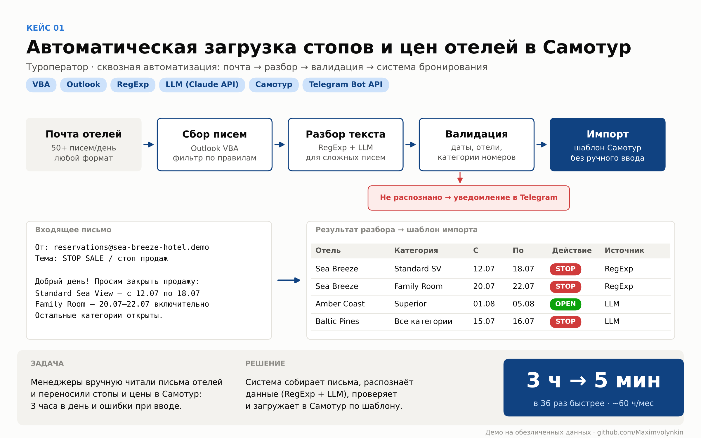
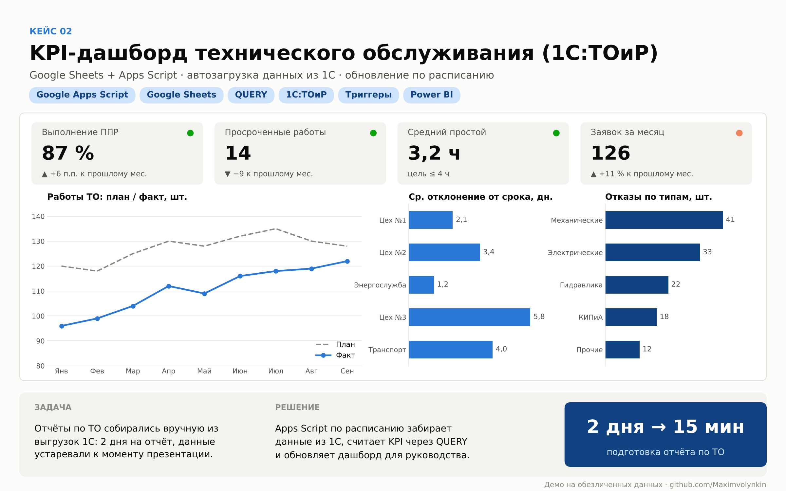
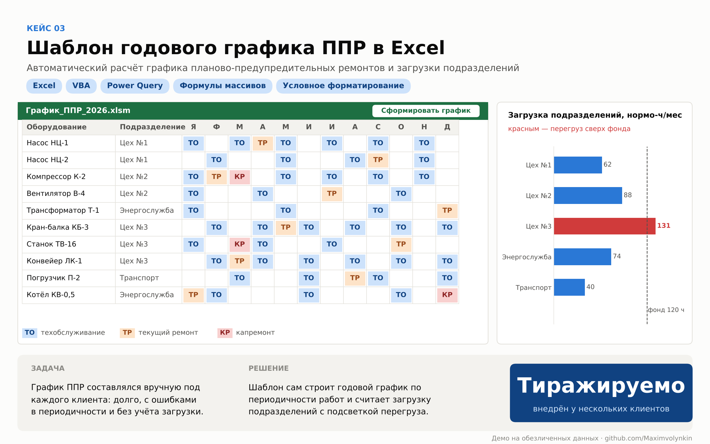
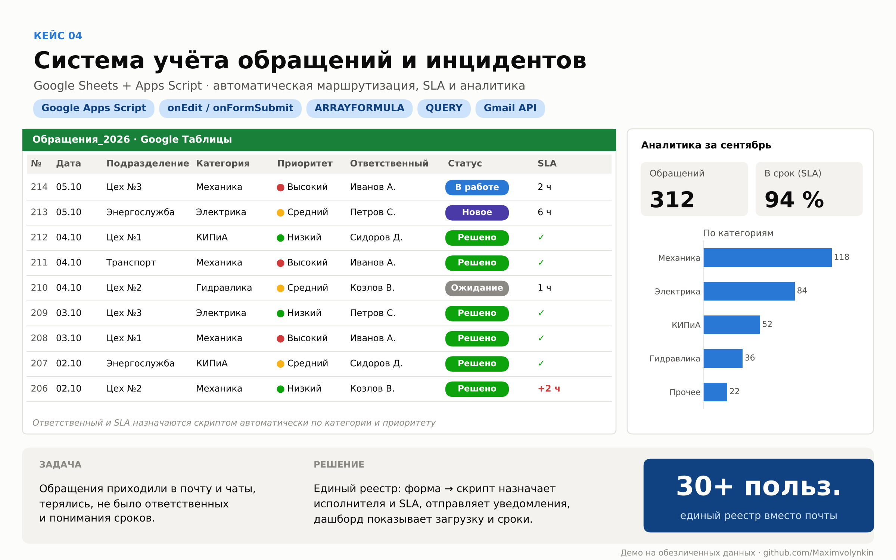
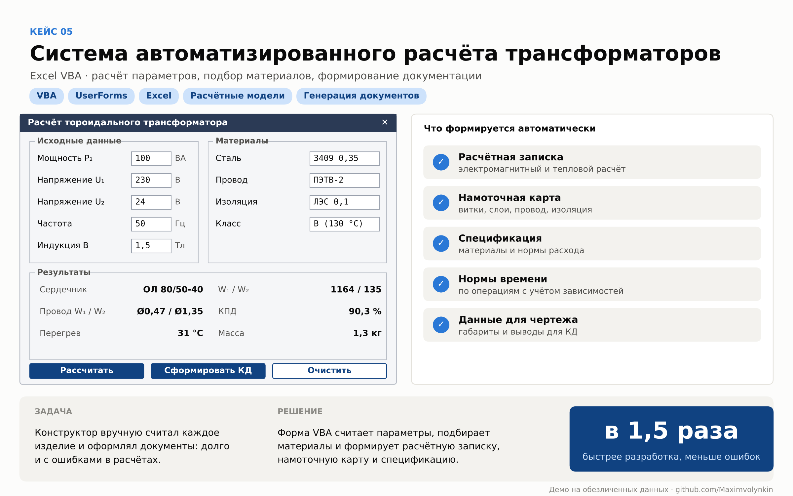
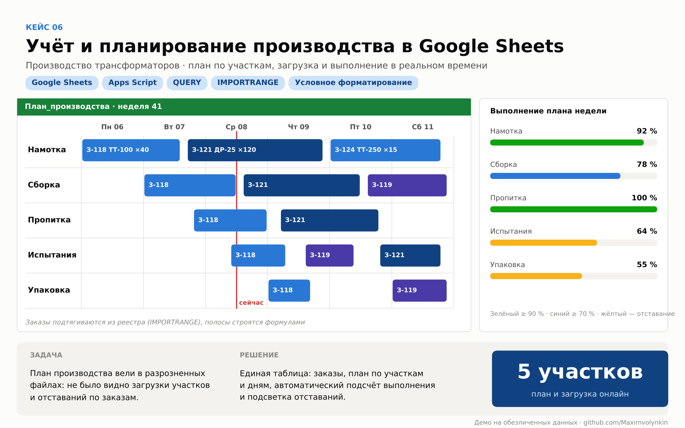
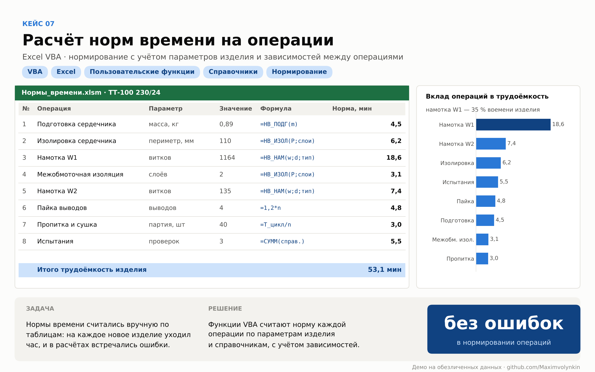
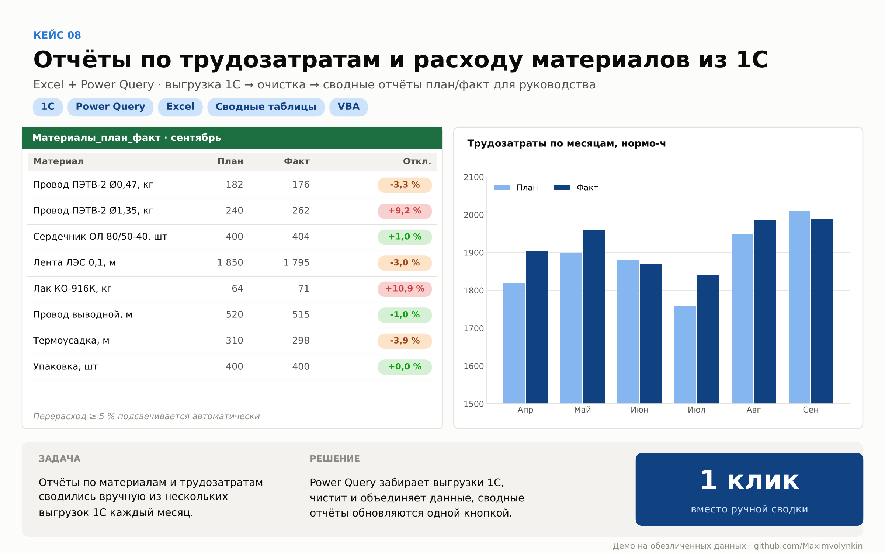
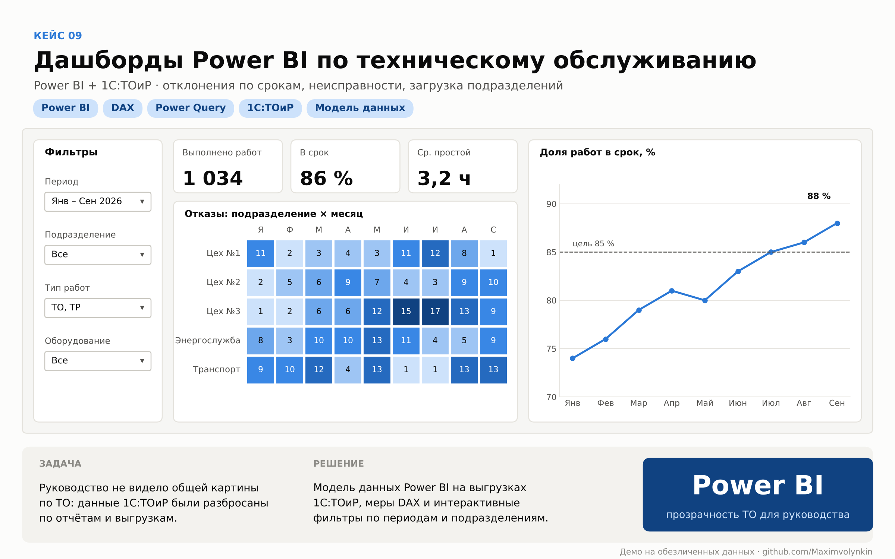
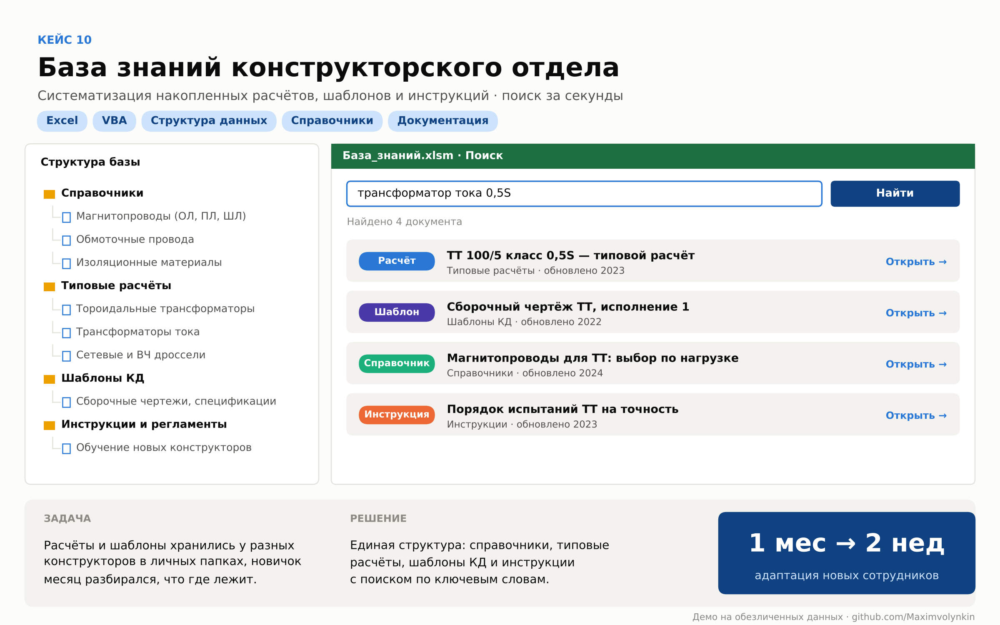

# Портфолио: автоматизация бизнес-процессов

> Все примеры — демонстрационные версии реальных проектов на обезличенных данных. Названия компаний, ФИО, отели и цифры в таблицах изменены; итоговые метрики соответствуют результатам проектов.

## Содержание

| № | Кейс | Стек | Результат |
|---|------|------|-----------|
| 01 | [Загрузка стопов и цен отелей в Самотур](#case-01) | VBA, Outlook, RegExp, LLM | 3 ч → 5 мин |
| 02 | [KPI-дашборд технического обслуживания](#case-02) | Apps Script, Google Sheets, 1С:ТОиР | 2 дня → 15 мин |
| 03 | [Шаблон годового графика ППР](#case-03) | Excel, VBA, Power Query | тиражируемое решение |
| 04 | [Учёт обращений и инцидентов](#case-04) | Apps Script, Google Sheets | 30+ пользователей |
| 05 | [Автоматизированный расчёт трансформаторов](#case-05) | Excel VBA, UserForms | в 1,5 раза быстрее |
| 06 | [Учёт и планирование производства](#case-06) | Google Sheets, Apps Script | 5 участков онлайн |
| 07 | [Расчёт норм времени на операции](#case-07) | Excel VBA | без ошибок нормирования |
| 08 | [Отчёты по трудозатратам и материалам из 1С](#case-08) | Power Query, Excel | отчёт одной кнопкой |
| 09 | [Дашборды Power BI по ТО](#case-09) | Power BI, DAX | прозрачность для руководства |
| 10 | [База знаний конструкторского отдела](#case-10) | Excel, VBA | адаптация 1 мес → 2 нед |

---

## 01 · Автоматическая загрузка стопов и цен отелей в Самотур

**Задача.** Менеджеры туроператора вручную читали письма отелей и переносили стопы, квоты и цены в систему бронирования Самотур: около 3 часов в день и ошибки при вводе.

**Решение.**
- Outlook VBA собирает письма отелей по правилам.
- Разбор текста: регулярные выражения для типовых писем, LLM (Claude API) для писем произвольного формата.
- Валидация дат, отелей и категорий номеров, затем загрузка в Самотур по шаблону импорта.
- Логирование и уведомления в Telegram о нераспознанных письмах и сбоях.

**Результат.** Ежедневная обработка сократилась **с 3 часов до 5 минут**, высвободилось около 60 часов работы отдела в месяц, исчезли продажи на закрытые даты.

`VBA` `Outlook` `RegExp` `LLM / Claude API` `Самотур` `Telegram Bot API`

---

## 02 · KPI-дашборд технического обслуживания (1С:ТОиР)

**Задача.** Отчёты по техобслуживанию собирались вручную из выгрузок 1С:ТОиР: около 2 дней на отчёт, данные устаревали к моменту презентации.

**Решение.** Apps Script по расписанию забирает данные из 1С, KPI считаются через QUERY и ARRAYFORMULA, дашборд с фильтрами обновляется без ручных выгрузок.

**Результат.** Подготовка отчёта **с 2 дней до 15 минут**, руководство видит актуальные показатели онлайн.

`Google Apps Script` `Google Sheets` `QUERY` `Триггеры` `1С:ТОиР`

---

## 03 · Шаблон годового графика ППР в Excel

**Задача.** График планово-предупредительных ремонтов составлялся вручную под каждого клиента: долго, с ошибками в периодичности, без учёта загрузки подразделений.

**Решение.** Шаблон строит годовой график по периодичности работ (ТО, ТР, КР), считает загрузку подразделений в нормо-часах и подсвечивает перегруз сверх фонда времени.

**Результат.** Тиражируемое решение, внедрено у нескольких клиентов.

`Excel` `VBA` `Power Query` `Формулы массивов` `Условное форматирование`

---

## 04 · Система учёта обращений и инцидентов

**Задача.** Обращения приходили в почту и чаты, терялись, не было ответственных и контроля сроков.

**Решение.** Единый реестр в Google Sheets: заявка через форму, скрипт назначает ответственного и SLA по категории и приоритету, отправляет уведомления; аналитика по категориям и соблюдению сроков.

**Результат.** Единый реестр вместо почты, систему используют **30+ сотрудников**.

`Google Apps Script` `onEdit / onFormSubmit` `ARRAYFORMULA` `QUERY` `Gmail`

---

## 05 · Система автоматизированного расчёта трансформаторов

**Задача.** Конструктор вручную рассчитывал каждое изделие и оформлял документы: долго и с ошибками.

**Решение.** Форма на Excel VBA рассчитывает параметры, подбирает материалы и формирует расчётную записку, намоточную карту, спецификацию и нормы времени.

**Результат.** Время разработки изделия и количество ошибок сократились **в 1,5 раза**.

`VBA` `UserForms` `Excel` `Расчётные модели` `Генерация документов`

---

## 06 · Учёт и планирование производства в Google Sheets

**Задача.** План производства вели в разрозненных файлах, не было видно загрузки участков и отставаний по заказам.

**Решение.** Единая таблица: заказы из реестра, план по участкам и дням, автоматический подсчёт выполнения и подсветка отставаний.

**Результат.** План, загрузка и сроки **по 5 участкам** в реальном времени.

`Google Sheets` `Apps Script` `QUERY` `IMPORTRANGE` `Условное форматирование`

---

## 07 · Расчёт норм времени на операции

**Задача.** Нормы времени считались вручную по таблицам, в расчётах встречались ошибки.

**Решение.** Пользовательские функции VBA считают норму каждой операции по параметрам изделия и справочникам с учётом зависимостей между операциями.

**Результат.** Исключены ошибки в нормировании, трудоёмкость нового изделия считается автоматически.

`VBA` `Excel` `Пользовательские функции` `Справочники`

---

## 08 · Отчёты по трудозатратам и расходу материалов из 1С

**Задача.** Отчёты по материалам и трудозатратам каждый месяц сводились вручную из нескольких выгрузок 1С.

**Решение.** Power Query забирает выгрузки 1С, очищает и объединяет данные; сводные отчёты план/факт с подсветкой перерасхода обновляются одной кнопкой.

**Результат.** Управленческая отчётность по материалам и трудозатратам без ручной сводки.

`1С` `Power Query` `Excel` `Сводные таблицы` `VBA`

---

## 09 · Дашборды Power BI по техническому обслуживанию

**Задача.** Руководство не видело общей картины по ТО: данные 1С:ТОиР были разбросаны по отчётам и выгрузкам.

**Решение.** Модель данных Power BI на выгрузках 1С:ТОиР, меры DAX, интерактивные фильтры по периодам, подразделениям и типам работ.

**Результат.** Прозрачная картина по срокам, неисправностям и загрузке подразделений.

`Power BI` `DAX` `Power Query` `1С:ТОиР`

---

## 10 · База знаний конструкторского отдела

**Задача.** Расчёты и шаблоны хранились у разных конструкторов в личных папках, новый сотрудник долго разбирался, что где лежит.

**Решение.** Единая структура: справочники, типовые расчёты, шаблоны КД и инструкции с поиском по ключевым словам.

**Результат.** Адаптация новых сотрудников сократилась **с 1 месяца до 2 недель**.

`Excel` `VBA` `Структура данных` `Документация`
